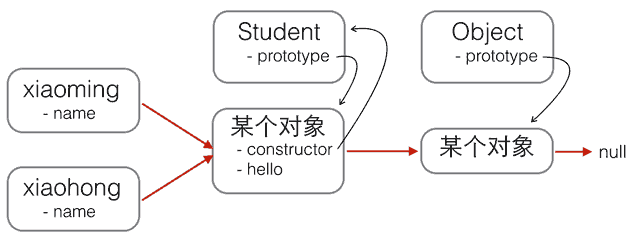
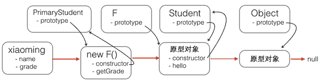

## 直接看5-3 

在传统的基于Class的语言如Java、C++中，继承的本质是扩展一个已有的Class，并生成新的Subclass。

由于这类语言严格区分类和实例，继承实际上是类型的扩展。
- 但是，JavaScript由于采用原型继承，我们无法直接扩展一个Class，因为根本不存在Class这种类型。

但是办法还是有的。我们先回顾Student构造函数：

```
function Student(props) {
    this.name = props.name || 'Unnamed';
}

Student.prototype.hello = function () {
    alert('Hello, ' + this.name + '!');
}
```

以及Student的原型链：



现在，我们要基于Student扩展出PrimaryStudent，可以先定义出PrimaryStudent：

```
function PrimaryStudent(props) {
    // 调用Student构造函数，绑定this变量:
    Student.call(this, props);
    this.grade = props.grade || 1;
}
```

但是，调用了Student构造函数不等于继承了Student，PrimaryStudent创建的对象的原型是：
```
new PrimaryStudent() ----> PrimaryStudent.prototype ----> Object.prototype ----> null
```
必须想办法把原型链修改为：
```
new PrimaryStudent() ----> PrimaryStudent.prototype ----> Student.prototype ----> Object.prototype ----> null
```

这样，原型链对了，继承关系就对了。新的基于PrimaryStudent创建的对象不但能调用PrimaryStudent.prototype定义的方法，也可以调用Student.prototype定义的方法。

如果你想用最简单粗暴的方法这么干：
```
PrimaryStudent.prototype = Student.prototype;
```
是不行的！如果这样的话，PrimaryStudent和Student共享一个原型对象，那还要定义PrimaryStudent干啥？

- 我们必须借助一个中间对象来实现正确的原型链，这个中间对象的原型要指向Student.prototype。为了实现这一点，参考道爷（就是发明JSON的那个道格拉斯）的代码，中间对象可以用一个空函数F来实现：
```
// PrimaryStudent构造函数:
function PrimaryStudent(props) {
    Student.call(this, props);
    this.grade = props.grade || 1;
}

// 空函数F:
function F() {
}

// 把F的原型指向Student.prototype:
F.prototype = Student.prototype;

// 把PrimaryStudent的原型指向一个新的F对象，F对象的原型正好指向Student.prototype:
PrimaryStudent.prototype = new F();

// 把PrimaryStudent原型的构造函数修复为PrimaryStudent:
PrimaryStudent.prototype.constructor = PrimaryStudent;

// 继续在PrimaryStudent原型（就是new F()对象）上定义方法：
PrimaryStudent.prototype.getGrade = function () {
    return this.grade;
};

// 创建xiaoming:
var xiaoming = new PrimaryStudent({
    name: '小明',
    grade: 2
});
xiaoming.name; // '小明'
xiaoming.grade; // 2

// 验证原型:
xiaoming.__proto__ === PrimaryStudent.prototype; // true
xiaoming.__proto__.__proto__ === Student.prototype; // true

// 验证继承关系:
xiaoming instanceof PrimaryStudent; // true
xiaoming instanceof Student; // true

```
用一张图来表示新的原型链：



注意，函数F仅用于桥接，我们仅创建了一个new F()实例，而且，没有改变原有的Student定义的原型链。

- 如果把继承这个动作用一个inherits()函数封装起来，还可以隐藏F的定义，并简化代码：
```
function inherits(Child, Parent) {
    var F = function () {};
    F.prototype = Parent.prototype;
    Child.prototype = new F();
    Child.prototype.constructor = Child;
}
```
这个inherits()函数可以复用：
```
function Student(props) {
    this.name = props.name || 'Unnamed';
}

Student.prototype.hello = function () {
    alert('Hello, ' + this.name + '!');
}

function PrimaryStudent(props) {
    Student.call(this, props);
    this.grade = props.grade || 1;
}

// 实现原型继承链:
inherits(PrimaryStudent, Student);

// 绑定其他方法到PrimaryStudent原型:
PrimaryStudent.prototype.getGrade = function () {
    return this.grade;
};
```
小结
JavaScript的原型继承实现方式就是：

- 定义新的构造函数，并在内部用call()调用希望“继承”的构造函数，并绑定this；

- 借助中间函数F实现原型链继承，最好通过封装的inherits函数完成；

- 继续在新的构造函数的原型上定义新方法。