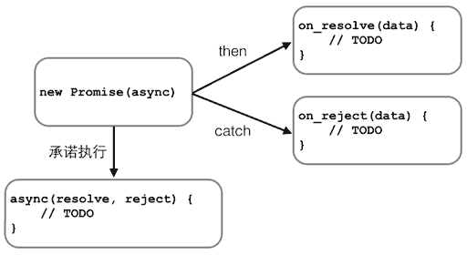

在JavaScript的世界中，所有代码都是单线程执行的。

由于这个“缺陷”，导致JavaScript的所有网络操作，浏览器事件，都必须是异步执行。异步执行可以用回调函数实现：
```
function callback() {
    console.log('Done');
}
console.log('before setTimeout()');
setTimeout(callback, 1000); // 1秒钟后调用callback函数
console.log('after setTimeout()');
```
观察上述代码执行，在Chrome的控制台输出可以看到：
```
before setTimeout()
after setTimeout()
```
(等待1秒后)
Done
- 可见，异步操作会在将来的某个时间点触发一个函数调用。

- AJAX就是典型的异步操作。以上一节的代码为例：
```
request.onreadystatechange = function () {
    if (request.readyState === 4) {
        if (request.status === 200) {
            return success(request.responseText);
        } else {
            return fail(request.status);
        }
    }
}
```
把回调函数success(request.responseText)和fail(request.status)写到一个AJAX操作里很正常，但是不好看，而且不利于代码复用。

有没有更好的写法？比如写成这样：
```
var ajax = ajaxGet('http://...');
ajax.ifSuccess(success)
    .ifFail(fail);
```
这种链式写法的好处在于，先统一执行AJAX逻辑，不关心如何处理结果，然后，根据结果是成功还是失败，在将来的某个时候调用success函数或fail函数。

古人云：“君子一诺千金”，这种“承诺将来会执行”的对象在JavaScript中称为Promise对象。

Promise有各种开源实现，在ES6中被统一规范，由浏览器直接支持。先测试一下你的浏览器是否支持Promise：

```
'use strict';
new Promise(function () {});
// 直接运行测试:
console.log('支持Promise!');
```

我们先看一个最简单的Promise例子：生成一个0-2之间的随机数，如果小于1，则等待一段时间后返回成功，否则返回失败：

```
function test(resolve, reject) {
    var timeOut = Math.random() * 2;
    log('set timeout to: ' + timeOut + ' seconds.');
    setTimeout(function () {
        if (timeOut < 1) {
            log('call resolve()...');
            resolve('200 OK');
        }
        else {
            log('call reject()...');
            reject('timeout in ' + timeOut + ' seconds.');
        }
    }, timeOut * 1000);
}
```


这个test()函数有两个参数，这两个参数都是函数，如果执行成功，我们将调用resolve('200 OK')，如果执行失败，我们将调用reject('timeout in ' + timeOut + ' seconds.')。
可以看出，test()函数只关心自身的逻辑，并不关心具体的resolve和reject将如何处理结果。

有了执行函数，我们就可以用一个Promise对象来执行它，并在将来某个时刻获得成功或失败的结果：
```
var p1 = new Promise(test);
var p2 = p1.then(function (result) {
    console.log('成功：' + result);
});
var p3 = p2.catch(function (reason) {
    console.log('失败：' + reason);
});
```
变量p1是一个Promise对象，它负责执行test函数。由于test函数在内部是异步执行的，当test函数执行成功时，我们告诉Promise对象：
```
// 如果成功，执行这个函数：
p1.then(function (result) {
    console.log('成功：' + result);
});
```
当test函数执行失败时，我们告诉Promise对象：
```
p2.catch(function (reason) {
    console.log('失败：' + reason);
});
```
Promise对象可以串联起来，所以上述代码可以简化为：
```
new Promise(test).then(function (result) {
    console.log('成功：' + result);
}).catch(function (reason) {
    console.log('失败：' + reason);
});
```

实际测试一下，看看Promise是如何异步执行的：
```
'use strict';
// 清除log:
var logging = document.getElementById('test-promise-log');
while (logging.children.length > 1) {
    logging.removeChild(logging.children[logging.children.length - 1]);
}

// 输出log到页面:
function log(s) {
    var p = document.createElement('p');
    p.innerHTML = s;
    logging.appendChild(p);
}

new Promise(function (resolve, reject) {
    log('start new Promise...');
    var timeOut = Math.random() * 2;
    log('set timeout to: ' + timeOut + ' seconds.');
    setTimeout(function () {
        if (timeOut < 1) {
            log('call resolve()...');
            resolve('200 OK');
        }
        else {
            log('call reject()...');
            reject('timeout in ' + timeOut + ' seconds.');
        }
    }, timeOut * 1000);
}).then(function (r) {
    log('Done: ' + r);
}).catch(function (reason) {
    log('Failed: ' + reason);
});
```

可见Promise最大的好处是在异步执行的流程中，把执行代码和处理结果的代码清晰地分离了：


## promise

Promise还可以做更多的事情，比如，有若干个异步任务，需要先做任务1，如果成功后再做任务2，任何任务失败则不再继续并执行错误处理函数。

要串行执行这样的异步任务，不用Promise需要写一层一层的嵌套代码。有了Promise，我们只需要简单地写：
```
job1.then(job2).then(job3).catch(handleError);
```
其中，job1、job2和job3都是Promise对象。

下面的例子演示了如何串行执行一系列需要异步计算获得结果的任务：
```
'use strict';
var logging = document.getElementById('test-promise2-log');
while (logging.children.length > 1) {
    logging.removeChild(logging.children[logging.children.length - 1]);
}
function log(s) {
    var p = document.createElement('p');
    p.innerHTML = s;
    logging.appendChild(p);
}
// 0.5秒后返回input*input的计算结果:
function multiply(input) {
    return new Promise(function (resolve, reject) {
        log('calculating ' + input + ' x ' + input + '...');
        setTimeout(resolve, 500, input * input);
    });
}
// 0.5秒后返回input+input的计算结果:
function add(input) {
    return new Promise(function (resolve, reject) {
        log('calculating ' + input + ' + ' + input + '...');
        setTimeout(resolve, 500, input + input);
    });
}
var p = new Promise(function (resolve, reject) {
    log('start new Promise...');
    resolve(123);
});
p.then(multiply)
 .then(add)
 .then(multiply)
 .then(add)
 .then(function (result) {
    log('Got value: ' + result);
});
```
 Run

- setTimeout可以看成一个模拟网络等异步执行的函数。
- 现在，我们把上一节的AJAX异步执行函数转换为Promise对象，看看用Promise如何简化异步处理：
```
'use strict';
// ajax函数将返回Promise对象:
function ajax(method, url, data) {
    var request = new XMLHttpRequest();
    return new Promise(function (resolve, reject) {
        request.onreadystatechange = function () {
            if (request.readyState === 4) {
                if (request.status === 200) {
                    resolve(request.responseText);
                } else {
                    reject(request.status);
                }
            }
        };
        request.open(method, url);
        request.send(data);
    });
}

var log = document.getElementById('test-promise-ajax-result');
var p = ajax('GET', '/api/categories');
p.then(function (text) { // 如果AJAX成功，获得响应内容
    log.innerText = text;
}).catch(function (status) { // 如果AJAX失败，获得响应代码
    log.innerText = 'ERROR: ' + status;
});
```
 Run
Result:

- 除了串行执行若干异步任务外，Promise还可以并行执行异步任务。

试想一个页面聊天系统，我们需要从两个不同的URL分别获得用户的个人信息和好友列表，这两个任务是可以并行执行的，用Promise.all()实现如下：
```
var p1 = new Promise(function (resolve, reject) {
    setTimeout(resolve, 500, 'P1');
});
var p2 = new Promise(function (resolve, reject) {
    setTimeout(resolve, 600, 'P2');
});

// 同时执行p1和p2，并在它们都完成后执行then:
Promise.all([p1, p2]).then(function (results) {
    console.log(results); // 获得一个Array: ['P1', 'P2']
});
```

有些时候，多个异步任务是为了容错。比如，同时向两个URL读取用户的个人信息，只需要获得先返回的结果即可。这种情况下，用Promise.race()实现：
```
var p1 = new Promise(function (resolve, reject) {
    setTimeout(resolve, 500, 'P1');
});
var p2 = new Promise(function (resolve, reject) {
    setTimeout(resolve, 600, 'P2');
});
Promise.race([p1, p2]).then(function (result) {
    console.log(result); // 'P1'
});
```
由于p1执行较快，Promise的then()将获得结果'P1'。p2仍在继续执行，但执行结果将被丢弃。

如果我们组合使用Promise，就可以把很多 异步任务 以 并行 和 串行 的方式组合起来执行。